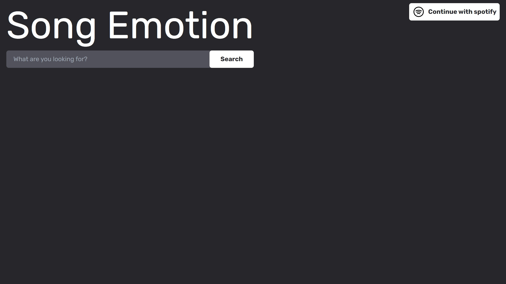
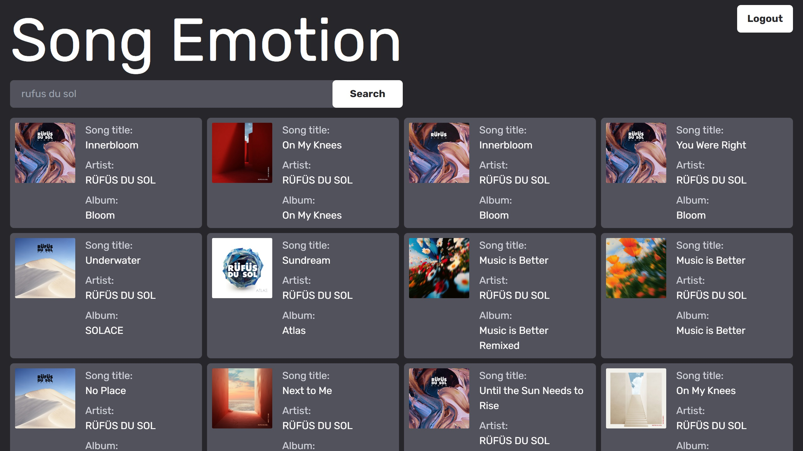
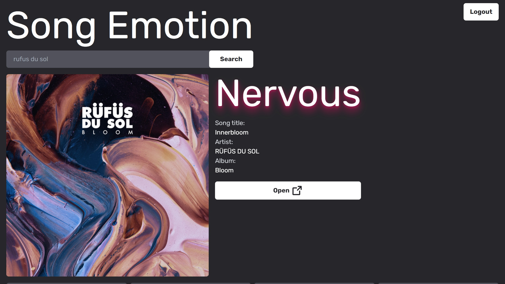

# Song emotion

## About

This website lets you check a song's emotion based on its valence and energy, using [Thayer's emotion classification](https://www.researchgate.net/figure/Human-emotional-classification-model-a-by-Russell-1980-and-b-Thayer-1991-In-the_fig1_334084112).

Spotify deprecated [get audio features](https://developer.spotify.com/documentation/web-api/reference/get-audio-features) endpoint that this project was based on.

## Used

- JavaScript
- Tailwind CSS
- Spotify API

#### Spotify account is only used to get access and refresh token.

## Screenshots

